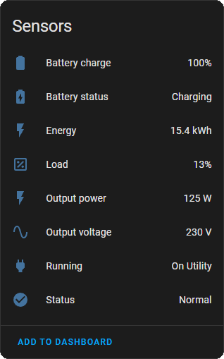

# Eaton UPS Companion - Home Assistant Integration

[![GitHub Release][releases-shield]][releases]
[![License][license-shield]](LICENSE)

This integration enables Home Assistant to communicate with an Eaton UPS Companion device. It provides sensor data and allows users to monitor their power backup systems.

    
    

## Installation

TBD: But hopfully it should be added to HACS soon!

## Configuration

Please follow the in-app instructions to set up your Eaton UPS Companion device.

## Features

This integration provides the following features:

* Sensor data for monitoring power backup systems

## Sensors

The integration includes the following sensors:

* 
* 

## Known Issues

Please refer to the issue tracker on GitHub for known issues and any open bugs.

## Dependencies

This integration uses the following modules:

- [`eaton-ups-companion`](https://github.com/sockless-coding/eaton-ups-companion)

## Support Development
- :coffee:&nbsp;&nbsp;[Buy me a coffee](https://www.buymeacoffee.com/sockless)

[license-shield]: https://img.shields.io/github/license/sockless-coding/ha-eaton-ups-companion.svg?style=for-the-badge
[releases-shield]: https://img.shields.io/github/release/sockless-coding/ha-eaton-ups-companion.svg?style=for-the-badge
[releases]: https://github.com/sockless-coding/ha-eaton-ups-companion/releases
